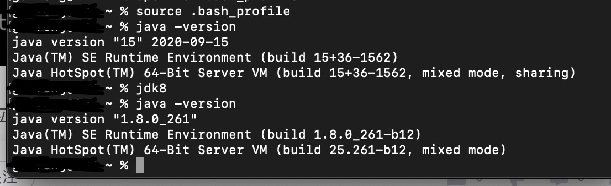

#  在macOS系统中，无缝切换JDK的版本

#### 作者：诡锋      B站：-诡锋丿Lavafall-

## 下载JDK

官网下载JDK：https://www.oracle.com/java/technologies/javase-downloads.html

需要注册登录Oracle账号

## 正式开始

安装好您的多个JDK后，可以在路径

~~~
/Library/Java/JavaVirtualMachines/
~~~

找到JDK, 如果您使用的是Intellij 的 IDE，可以在Project Structures里面的SDKs手动添加和切换JDK

其他的IDE我就不清楚怎么操作了

如果您的常用IDE无法选择JDK，本教程告诉您如何在命令行中快速替换。

~~~
# cd到根路径
cd

# 创建配置文件(如果您之前创建过，则跳过此步骤)
touch .bash_profile

# 打开配置文件
open -e .bash_profile

# 写入配置内容，我只有JDK8和15，就只拿这两个举例，大家有几个都可以添加进去
export JAVA_8_HOME=/Library/Java/JavaVirtualMachines/您的 JDK8 文件夹的名字/Contents/Home
export JAVA_15_HOME=/Library/Java/JavaVirtualMachines/您的 JDK15 文件夹的名字/Contents/Home

//此处为设置默认JDK的版本
export JAVA_HOME=$JAVA_15_HOME

//此处自定义macOS命令行语句,将JAVA_HOME指向前面已经暴露的JDK路径
alias jdk8="export JAVA_HOME=$JAVA_8_HOME"
alias jdk15="export JAVA_HOME=$JAVA_15_HOME"

# 将JAVA_HOME写入PATH路径中（也就是配置环境变量）
export PATH=$PATH:$JAVA_HOME/bin:$$GRADLE_HOME/bin
~~~

配置完毕后，记得按下command + S保存

然后回到命令行输入

~~~ shell
source ~/.bash_profile
~~~

使得该配置生效

### 最终效果

